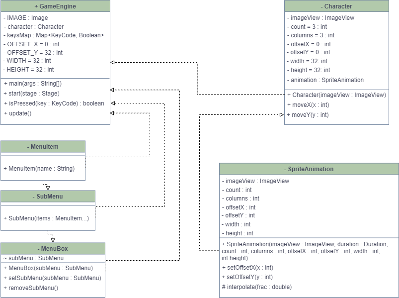

 ##Проект - игра "Назад в 90-е"
Игра "**Knocking on the unknown door**". В игре будут коридорные локации с множеством дверей. Двери могут вести как в какие-то комнаты, так и в прочие локации. По пути игрок будет преодолевать разные испытания.

Всего используются **6 классов**. Класс **GameEngine** ответственен за внутриигровую логику. Класс **Character** представляет персонажа, которым может управлять игрок. Класс **SpriteAnimation** отвечает за анимацию объектов, NPCs и самого персонажа. Класс **MenuItem** представляет собой ячейку меню загрузочного экрана. Класс **SubMenu** представляет собой подменю, отвечающее за расположение ячеек. Класс **MenuBox** представляет меню загрузочного окна, с которым может взаимодействовать пользователь.

**UML-диаграмма** приложения: 

ф