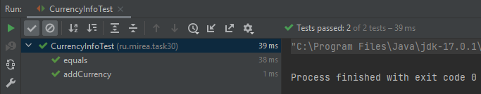

#Вывод по результатам тестирования в задании 30

В качестве тестируемого класса был выбран класс из пакета ru.mirea.task29 CurrencyInfo. Класс, испытывающий методы класса CurrencyInfo, называется CurrencyInfoTest. Он проверяет два метода: addCurrency(String currency, Double value), equals(Object obj). 

*Первый тест*. Создается объект класса CurrencyInfo currencyInfo. Вызывается метод addCurrency с параметрами "Доллар США", 73.4698 - наименование валюты и её курс соответственно. Суть метода заключается в добавлении пары ключ-значение в структуру HashMap currencies. Далее с помощью все того же метода добавляется несколько пар ключ-значение в данную структуру внутри объекта currencyInfo. Суть проверки в том, чтобы убедиться, что метод отрабатывает верно.

*Второй тест*. Создаются два объекта класса CurrencyInfo currencyInfo1 и currencyInfo2. Для каждого из них одинаково изменяются поля currencies и date. В классе CurrencyInfo переопределен метод toString. Его задача сводится к выводу информации об объекте. Поскольку для полей объектов currencyInfo1 и currencyInfo2 заданы одинаковые значения, то метод toString в обоих случаях возвратит одинаковую строку. Таким образом, сравнение основывается на методах toString. В результате сравнения объекты будут равны друг другу. Если бы метод equals не переопределялся, то объекты проверялись бы по ссылке и равенства не было бы.

Результат тестирования изображен на следующем рисунке:

